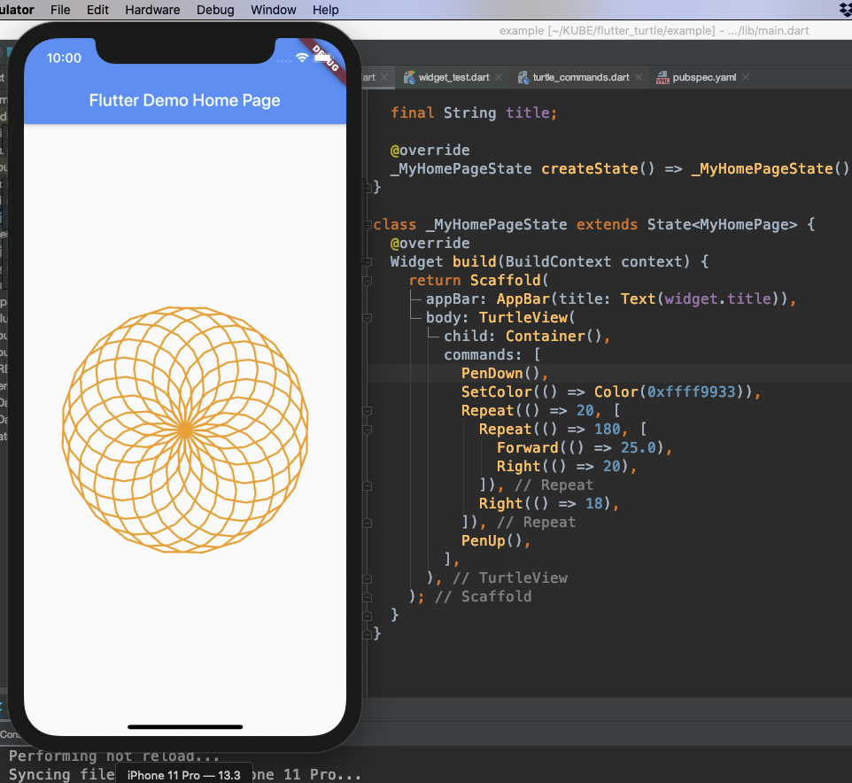

# flutter_turtle

flutter_turtle is a simple implementation of turtle graphics for Flutter. It
simply uses a custom painter to draw graphics by a series of Logo-like commands.

For further information about turtle graphics, please visit Wikipedia:

- https://en.wikipedia.org/wiki/Turtle_graphics
- https://en.wikipedia.org/wiki/Logo_(programming_language)

## Why I Make This?

It is always fun to make your own DSL!

## Example



A quick example:

```dart
@override
  Widget build(BuildContext context) {
    return Scaffold(
      appBar: AppBar(title: Text(widget.title)),
      body: TurtleView(
        child: Container(),
        commands: [
          PenDown(),
          SetColor(() => Color(0xffff9933)),
          Repeat(() => 20, [
            Repeat(() => 180, [
              Forward(() => 25.0),
              Right(() => 20),
            ]),
            Right(() => 18),
          ]),
          PenUp(),
        ],
      ),
    );
  }
```

## Commands

Currently supported commands are including:

- PenDown
- PenUp
- Left
- Right
- Forward
- SetColor
- SetStrokeWidth
- ResetPosition
- ResetHeading
- Repeat
